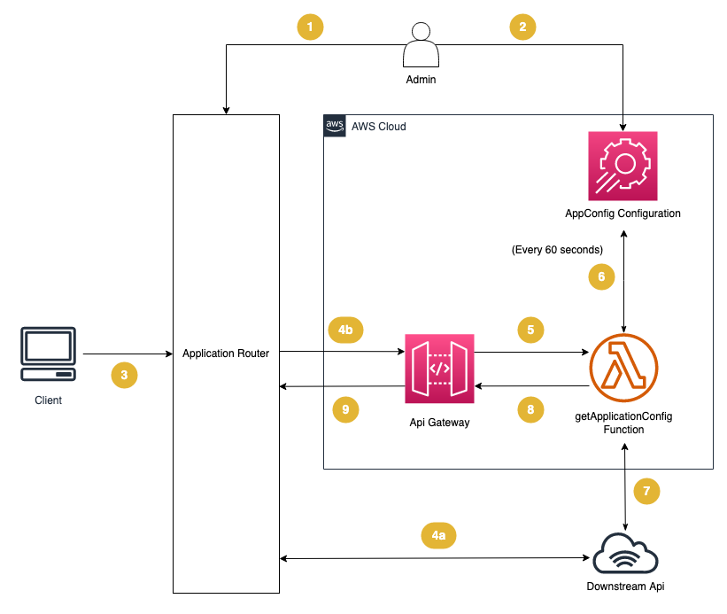

# Api Filtering Solution

## Contents

- **[1. Motivation](#heading--1)**
- **[2. How it works](#heading--2)**
  - [2.1. Architecture](#heading--2-1)
- **[3. Adoption](#heading--3)**
  - [3.1. Deployment](#heading--3-1)
  - [3.2. Configuration](#heading--3-2)

---

<div id="heading--1" />

## 1. Motivation

This solution outlines how you can apply response filtering to a preexisting application using AWS Services.

The solution is configurable without an application deploy.

This solution is handy when you have a closed source API that you need to filter responses on based on a parameter or header condition being met. i.e. filtering reponses based on user group.

---

<div id="heading--2" />

## 2. How it works

<div id="heading--2-1" />

### 2.1 Architecture



1. The Admin configures the routes that will need filtering on their application router
2. The Admin adds filtering rules to app config, specifying the routes to filter on and what to filter out of the responses.
3. The client makes an API request
4. a) The request made by the client does not require filtering and is passed directly to the downstream API. The full response is returned to the application router for the client to consume.

   b) The request made by the client requires filtering and is passed to the Api Gateway

5. The Api Gateway passes all requests to the getApplicaitonConfig function.

6. a) On cold start, the function retrieves the filtering configuration from AppConfig and stores a cached copy in memory.

   b) On warm start, the function already has a cached copy of the rules from AppConfig. The function checks if it needs to retrieve an updated copy of the config if the poll timeout has elapsed.

7. The function calls the downstream Api passing all the same headers, body and query string parameters from the original request.

8. The function waits for a response then applies the filtering rules to the response and returns it to the Api Gateway

9. The Api Gateway returns the filtered response to the application router for the client to consume.

---

<div id="heading--3" />

## 3. Adoption

<div id="heading--3-1" />

### 3.1. Deployment

The following steps are for Linux/Mac

1. Install the following dependencies on your local machine:

   - [AWS CDK](https://docs.aws.amazon.com/cdk/v2/guide/getting_started.html)
   - NodeJS v16, [use nvm](https://github.com/nvm-sh/nvm#installing-and-updating)

1. Open a terminal in the current directory and install the application dependencies

   ```bash
   npm install
   ```

1. Set up your `AWS_PROFILE` and `AWS_REGION` environment variables

   ```bash
   export AWS_PROFILE={YOUR PROFILE NAME}
   export AWS_REGION={YOUR AWS ACCOUNT REGION}
   ```

1. Bootstrap the CDK toolset in the account you wish to deploy the application into

   ```bash
   npx cdk bootstrap
   ```

1. Deploy the application into your account
   ```bash
   npx cdk deploy
   ```

<div id="heading--3-2" />

### 3.2.1 Configuration

This application uses AppConfig to store runtime configuration items.
On first deploy, [an initial configuration file](./infrastructure//config//initialConfig.json) will be used as v1. Feel free to modify the inital configuration items prior to the first deploy.

Subsequent configuration updates can be modified through the AppConfig AWS console.

Configurable entries are as follows:

| Configuration Item | Data type               | Description                                                                                                                                                                    |
| ------------------ | ----------------------- | ------------------------------------------------------------------------------------------------------------------------------------------------------------------------------ |
| baseUrl            | string                  | The downstream HTTP endpoint that the application will send requests to.                                                                                                       |
| errorOnMissingKey  | Boolean                 | Whether the application should throw an error if one of the filter paths are missing in the response returned from the downstream API endpoint on a successful (2xx) response. |
| filters            | Array of filter objects | [see filters](#heading--3-2-2)                                                                                                                                                 |

<div id="heading--3-2-2" />

### 3.2.2 Filters

The filter configuration item contains an array of filter objects.

A filter object contains the following properties:

- method - analagous to the HTTP method i.e. GET, the method to apply the filter rules to
- path - the path to apply the filter rules to
- filterPaths - an array of filter rules to apply to the returned object from the downstream api

The filter rules will only apply when both the method and path match the incomming requests method and path.

### 3.2.3 Filter rules

Filter Rules correspond to the property path on the returning JSON opject from the downstream API. Each filter rule will apply to a single property on an object or multiple array values. All rules and array values are case sensitive.

#### Basic filtering

The filter rule of `"hello"` will filter out the property named hello on the following object

```json
{
  "hello": "world",
  "name": "john"
}
```

The resulting object will be

```json
{
  "name": "john"
}
```

#### Nested object filtering

Period "." can be used to denote a nested property on an object. e.g. the filter rule `"hello.world"` will filter out the property named world on the object hello as follows

```json
{
  "hello": {
    "world": "earth",
    "size": "large"
  },
  "name": "john"
}
```

The resulting object will be

```json
{
  "hello": {
    "size": "large"
  },
  "name": "john"
}
```

#### Nested collection filtering

Object properties residing in an array can also be removed. To filter a property from an object, you will need to use the ".[]." filterPath to denote an array.
e.g. the filter rule `"hello.worlds.[].name" will filter out all the name properties on objects in the world array.

```json
{
  "hello": {
    "worlds": [
      {
        "name": "earth",
        "age": 4.543
      },
      {
        "name": "mars",
        "age": 4.603
      },
      {
        "age": 42
      }
    ]
  },
  "name": "john"
}
```

The resulting object will be

```json
{
  "hello": {
    "worlds": [
      {
        "age": 4.543
      },
      {
        "age": 4.603
      },
      {
        "age": 42
      }
    ]
  },
  "name": "john"
}
```

#### Array value filtering

Basic Array values (strings, numbers, boolean) can also be filtered out by typing the values to remove separated by a comma inside of the array object. e.g. a filter rule of `"hello.[Hannah,Ross]"` with the following object:

```json
{
  "hello": ["Julian", "Ben", "Hannah", "Ross", "Noor"]
}
```

Will result in the following object being returned

```json
{
  "hello": ["Julian", "Ben", "Noor"]
}
```

#### Combining filters

The `filterPath` configuration property is an array that accepts any of the above filter rules and will apply the rules in order. If a rule doesn't match the object, it will be ignored and the next rule will be evaluated unless the `errorOnMissingKey` property is set to `true`.

e.g. Combining multiple filterPath rules

```json
{
  "baseUrl": "https://something.com",
  "errorOnMissingKey": false,
  "filters": [
    {
      "method": "GET",
      "path": "/information",
      "filterPaths": [
        "users.[].age",
        "users.[].addresses.[hello world]",
        "users.[].friends",
        "version"
      ]
    }
  ]
}
```

```json
{
  "version": 0.1,
  "users": [
    {
      "name": "Julian",
      "age": 100,
      "addresses": ["hope st", "dawn rd", "hello world"],
      "friends": [
        {
          "name": "Ross",
          "age": 120
        }
      ]
    },
    {
      "name": "Ross",
      "age": 120,
      "addresses": ["country town", "fake place"],
      "friends": [
        {
          "name": "Julian",
          "age": 100
        }
      ]
    }
  ]
}
```

Will result in the following object being returned

```json
{
  "users": [
    {
      "name": "Julian",
      "addresses": ["hope st", "dawn rd"]
    },
    {
      "name": "Ross",
      "addresses": ["country town", "fake place"]
    }
  ]
}
```
